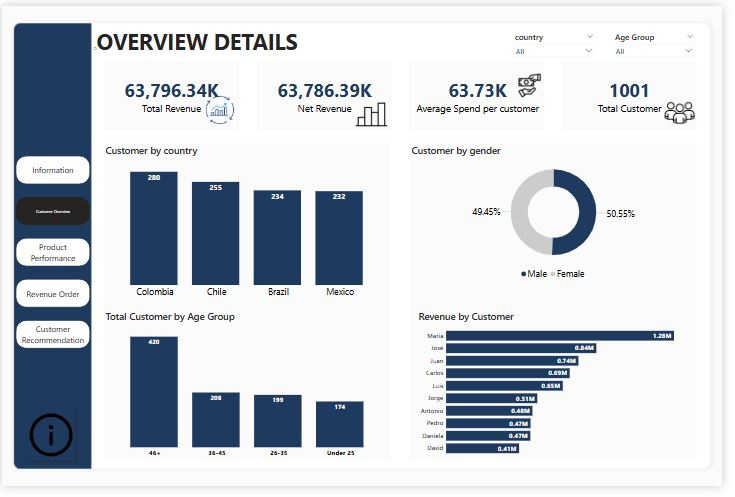
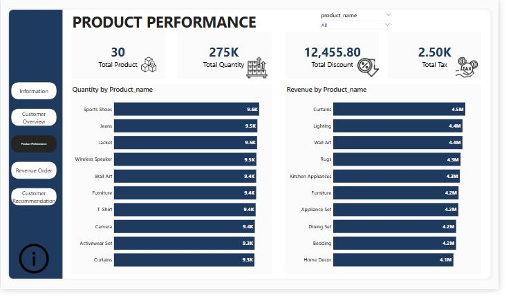
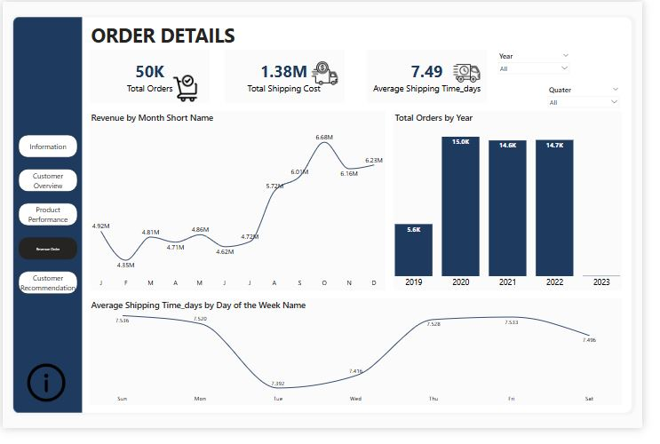
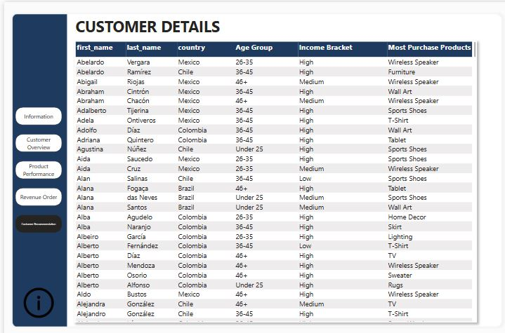

#  Customer Insights & Product Recommendations Dashboard

##  Project Overview

This dashboard is designed to help the business understand its customer base, improve customer experience, and increase revenue by recommending relevant products based on data-driven insights.

---

##  Goals

- Build and segment a loyal customer base  
- Analyze customer purchase behavior  
- Recommend relevant products to each customer  
- Identify revenue growth opportunities  

---

##  Dataset Summary

- **Customer Table:** Demographic details like Name, Gender, Age, Country, and Income  
- **Purchase Table:** Sales data including Price, Quantity, Discount, Tax, and Order Date  
- **Product Table:** Product ID, Name, and Descriptions  

---

##  Key Metrics & Features

- **Total & Net Revenue**  
- **Average Spend per Customer**  
- **Purchase Frequency & Trends**  
- **Top-Selling Products**  
- **Customer Segmentation** (Age, Gender, Country, Income)  
- **Basic Product Recommendations**  
- **Delivery/Shipping Insights**  

---

##  Tools Used

- **Power BI**  
- **DAX Measures & Calculated Columns**  
- **Calendar Table for Date Intelligence**  
- **Data Modeling & Relationships**  

---

## Business Value

This report offers deep insights into customer behavior and product performance, enabling smarter business decisions, improved targeting, and increased customer satisfaction.
##  Dashboard Previews

Here are screenshots of my Power BI project:

  
  
  

